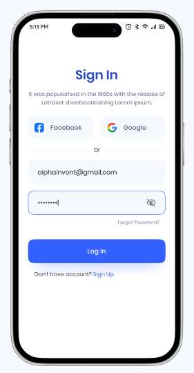
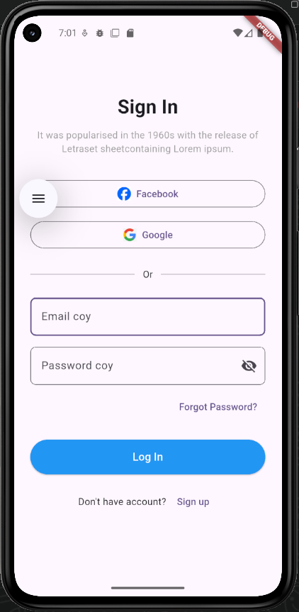

<div align="center">
  <h1>🚀 E-Wallet Login Slicing</h1>
  <p><em>Pixel-Perfect UI Implementation for Modern Mobile Authentication</em></p>

  
  
  
  
</div>

<br />

> **Figma Design Reference:** [E-Wallet Mobile App Community File](https://www.figma.com/community/file/1327203150107775164)

### Design Preview vs Slicing Result
| Design Reference | Slicing Result |
|:---:|:---:|
|  |  |

## 1. Project Background & Objective

### Latar Belakang & Pernyataan Masalah (*Problem Statement*)
Kesan pertama pengguna terhadap suatu aplikasi sangat bergantung pada halaman otentikasinya. Desain *login* yang kaku, lambat, atau tidak responsif sering kali menyebabkan tingkat *drop-off* yang tinggi pada fase *onboarding*. Tantangan utamanya adalah mengonversi desain statis (Figma) menjadi komponen antarmuka yang interaktif, *pixel-perfect*, dan mampu beradaptasi dengan berbagai ukuran layar *smartphone*.

### Solusi yang Ditawarkan (*The Solution*)
Proyek ini merupakan implementasi *UI Slicing* spesifik untuk halaman **Login E-Wallet**. Berfokus pada presisi visual dan ergonomi, proyek ini mereplika referensi desain secara akurat menggunakan kerangka kerja Flutter. Halaman ini tidak hanya menampilkan elemen antarmuka statis, tetapi juga telah mengintegrasikan *form validation* dasar, memberikan umpan balik visual (*visual feedback*) saat interaksi, dan mempersiapkan struktur komponen yang siap dihubungkan (*API-ready*) ke sistem *backend*.

### Proporsi Nilai Utama (*Value Proposition*)
- **High-Fidelity UI/UX:** Transisi desain yang akurat dengan menjaga hierarki tipografi, presisi *padding*, dan palet warna (*color grading*).
- **Responsive Layout:** Penyesuaian tata letak dinamis yang mendukung berbagai resolusi perangkat (iOS dan Android).
- **Modular Component Design:** Pendekatan *reusable widgets* untuk memastikan kode *frontend* tetap bersih (*clean code*) dan mudah dikelola (*maintainable*).

---

## 2. Key Features & Tech Stack

### Rincian Fitur Utama (*Features Breakdown*)
1. **Interactive Form Validation:** Pengecekan *input* secara mandiri (seperti format email yang valid dan panjang minimum *password*) sebelum *request* otentikasi dikirim.
2. **Password Visibility Toggle:** Fitur *obscure text* yang memungkinkan pengguna menampilkan atau menyembunyikan kata sandi mereka demi kenyamanan dan keamanan.
3. **API-Ready Controllers:** Seluruh *text field* telah dihubungkan dengan `TextEditingController`, sehingga sangat mudah untuk disinkronisasikan dengan *payload* JSON menuju sistem *backend* atau *state management*.
4. **Adaptive Styling:** Penerapan *custom themes* untuk menjaga konsistensi warna (Warna Utama, Aksen, Latar Belakang) di seluruh elemen *widget*.

### Teknologi & Arsitektur (*Tech Stack & Architecture Rationale*)

| Kategori | Teknologi | Alasan Teknis (*Rationale*) |
| :--- | :--- | :--- |
| **Mobile Framework** | Flutter | Menghasilkan performa *native* (60 FPS) dengan satu *codebase* dan kapabilitas *rendering engine* (Skia/Impeller) yang superior untuk detail UI. |
| **Programming Language**| Dart | Mendukung pemrograman deklaratif untuk UI dan *null-safety* yang ketat guna mencegah *runtime errors* pada komponen form. |
| **Asset Management** | `pubspec.yaml` | Pengelolaan *custom fonts* (seperti Google Fonts) dan gambar *vector/raster* secara terpusat untuk efisiensi pemuatan. |

---

## 3. Architecture & Directory Structure

Proyek ini disusun dengan memisahkan *widgets* umum dengan halaman utama (layar), sehingga mengikuti prinsip *Single Responsibility*.

**Struktur Direktori Proyek (`lib/`):**
```text
slicing/
├── assets/
│   ├── contoh.png            # Gambar referensi desain
│   └── hasil.png             # Screenshot hasil slicing
├── lib/
│   ├── core/
│   │   ├── theme/            # Konfigurasi warna, tipografi, dan tema aplikasi
│   │   └── constants/        # Nilai konstan (ukuran, durasi animasi, string)
│   ├── widgets/              # Reusable custom widgets (CustomTextField, PrimaryButton)
│   ├── screens/              # Layar utama
│   │   └── login_screen.dart # Implementasi UI form login E-Wallet
│   └── main.dart             # Entry point aplikasi Flutter
├── pubspec.yaml              # Dependensi dan registrasi asset proyek
└── README.md                 # Dokumentasi proyek
```

---

## 4. Getting Started & Installation Guide

### Persyaratan Sistem (*Prerequisites*)
Pastikan Anda telah memasang *tools* berikut di lingkungan pengembangan Anda:
- **Flutter SDK** (v3.19+ direkomendasikan)
- **Dart SDK**
- IDE seperti **VS Code** atau **Android Studio** dengan *plugin* Flutter terinstal.

### Langkah-langkah Instalasi (*Step-by-Step Installation*)

**1. Clone Repository**
```bash
git clone <YOUR_REPOSITORY_URL>
cd slicing
```

**2. Install Dependencies**
Ambil semua dependensi pihak ketiga (jika ada) dan perbarui konfigurasi *assets*.
```bash
flutter pub get
```

**3. Menjalankan Aplikasi (*Run the Application*)**
Jalankan emulator Android/iOS, atau sambungkan perangkat fisik Anda. Kemudian eksekusi perintah berikut:
```bash
flutter run
```

---

## 5. Implementation Notes / Core Usage Example

Meskipun logika *backend* belum diimplementasikan pada tahap *slicing* ini, *frontend* telah menyiapkan *method* kerangka (*stub*) untuk penanganan otentikasi. Berikut adalah representasi logika *login* yang siap diintegrasikan dengan *HTTP client* (misal: `http` atau `dio`):

```dart
// Contoh snippet pada login_screen.dart

void _handleLogin() async {
  if (_formKey.currentState!.validate()) {
    // Tampilkan indikator loading (Loading State)
    setState(() => _isLoading = true);
    
    final String email = _emailController.text;
    final String password = _passwordController.text;
    
    try {
      // TODO: Ganti dengan panggilan API sesungguhnya di sini
      // await AuthService.login(email: email, password: password);
      
      print('Payload siap dikirim: {"email": "$email", "password": "***"}');
      
      // Navigasi ke halaman beranda jika sukses
      // Navigator.pushReplacementNamed(context, '/home');
    } catch (e) {
      // Tangani error (Tampilkan SnackBar / Dialog)
    } finally {
      setState(() => _isLoading = false);
    }
  }
}
```

---

## 6. Testing & Quality Assurance

Karena ini adalah proyek *slicing* antarmuka, pengujian ditekankan pada konsistensi UI.
- **Widget Testing:** Memastikan komponen form dapat melakukan validasi secara independen.
- **UI/UX Verification:** *Hot reload* digunakan secara intensif untuk membandingkan margin, *padding*, dan proporsi warna dengan dokumen Figma secara langsung (*manual visual regression checking*).

Untuk menjalankan *testing* dasar bawaan Flutter (jika telah dikonfigurasi):
```bash
flutter test
```

---

## 7. Deployment & Production Setup

Jika Anda ingin mengkompilasi *slicing* ini ke dalam bentuk aplikasi yang bisa dipasang (APK/AAB atau IPA) untuk presentasi atau uji coba di perangkat pengguna target:

**Build APK (Android):**
```bash
flutter build apk --release
```

**Build Appbundle (Google Play):**
```bash
flutter build appbundle --release
```

**Build iOS (Memerlukan Xcode di macOS):**
```bash
flutter build ios --release
```

---

## 8. Contributing & License

### Panduan Kontribusi (*Contributing Guide*)
Bagi developer lain yang ingin berkontribusi dalam memperluas proyek *slicing* ini:
- Semua penambahan UI baru harus mempertahankan *pixel-perfect accuracy* berdasarkan panduan desain Figma.
- Gunakan pendekatan *Custom Widgets* jika Anda menambahkan elemen yang berpotensi digunakan berulang di halaman lain.
- Terapkan *Conventional Commits* pada setiap pembaruan cabang (branch).

### Lisensi (*License*)
Kode *slicing* antarmuka ini bersifat *open-source* dan didistribusikan di bawah **MIT License**.